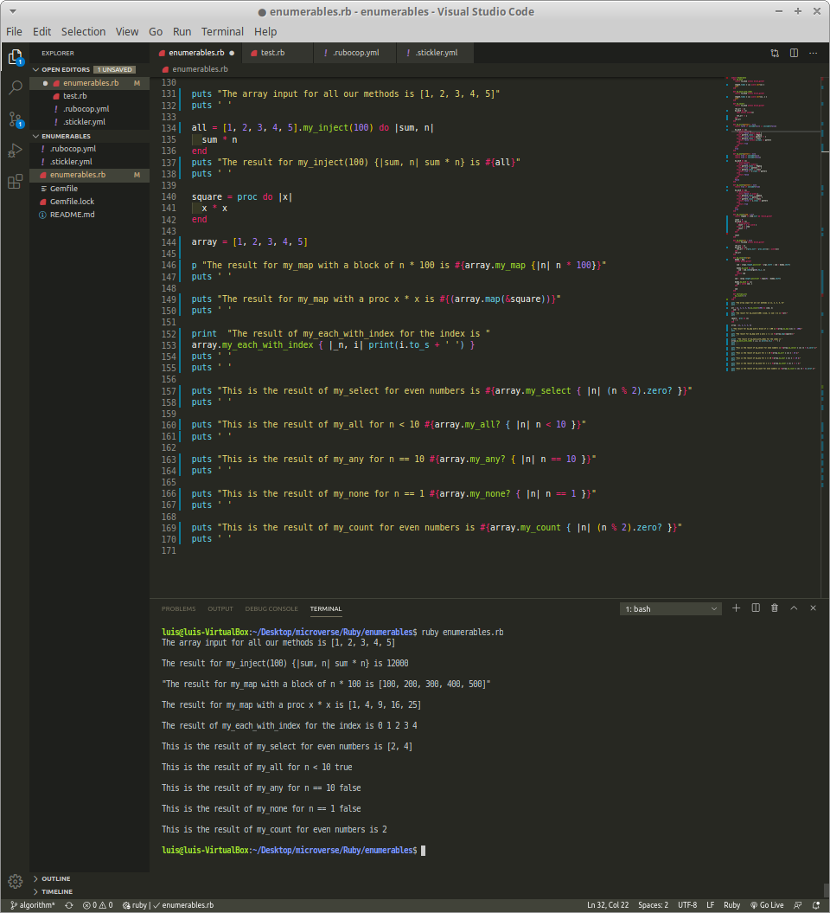

# bubble-sort

> In this project, I rewrote some of the most commonly used Ruby Enumerable methods. It was a great exercise to understand how the ruby methods work, how to modify a Module, practice how to use yields, and procs along with all the previously acquired knowledge.



These new personalized methods return the same variable type and output that the original methods of the Module. To achieve that, I had to write some complex coding that overpassed the allowed complexity by Rubocop, so I had to override the CyclomaticComplexity cop.

## Live version

[Live Version](https://repl.it/@lmaldonadoch/Enumerable-methods)

## Built With

- Ruby
- VSCode

## Getting Started

To get a local copy of the repository please run the following commands on your terminal:

```
$ cd <folder>
```

```
$ git clone git@github.com:lmaldonadoch/enumerables.git
```

## Author

👤 **Luis Angel Maldonado**

- Github: [@lmaldonadoch](https://github.com/lmaldonadoch)
- Twitter: [@LuisAngelMCh](https://twitter.com/LuisAngelMCh)
- Linkedin: [linkedin](https://www.linkedin.com/in/luis-angel-maldonado-5b503a1a3/)

## 🤝 Contributing

Contributions, issues and feature requests are welcome!

Feel free to check the [issues page](https://github.com/lmaldonadoch/HTML-CSS-Capstone/issues).

## Show your support

Give a ⭐️ if you like this project!

## Acknowledgments

- Project inspired by Microverse Program.
- Project originally taken from [The Odin Project](https://www.theodinproject.com/courses/ruby-programming/lessons/bubble-sort)
